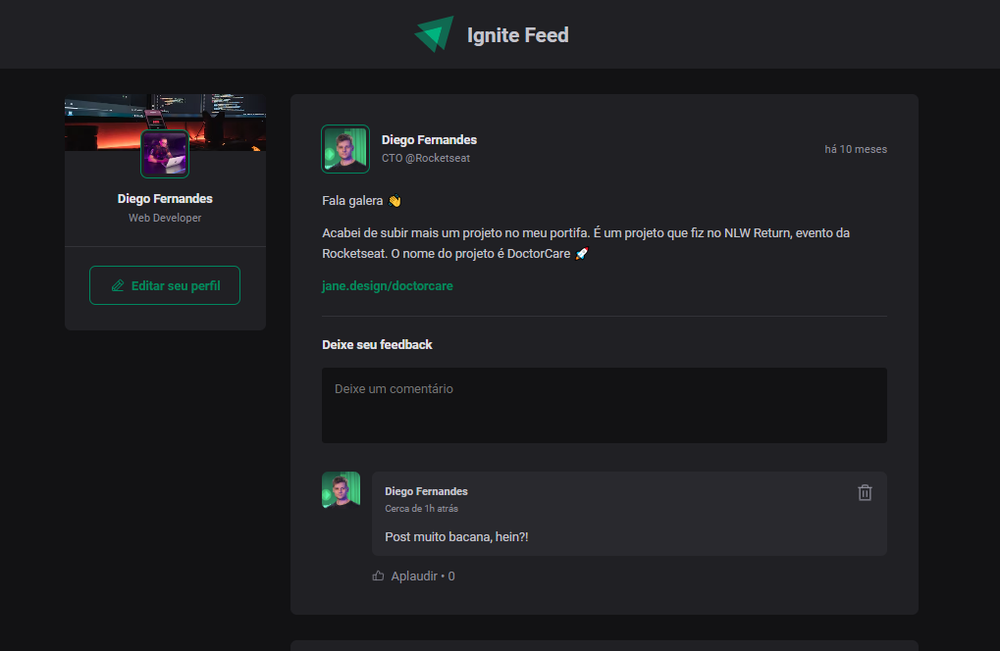

<h1 align="center">Ignite Feed</h1>

Projeto proposto no curso Ignite da Rocketseat

  <a href="#-tecnologias">Tecnologias</a>

 

  

## Tecnologias

Esse projeto foi desenvolvido com as seguintes tecnologias:

- React
- CSS Modules
- TypeScript
- Vite
- DateFNS
- Git e Github
